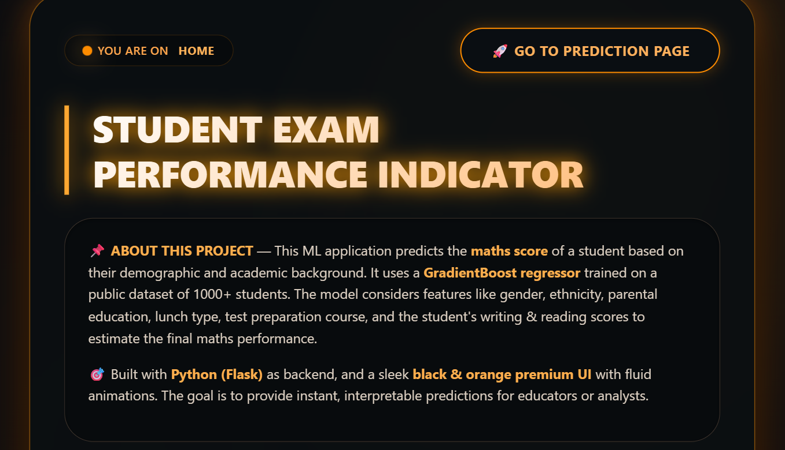

# 🎓 Student Exam Performance Indicator

> 🚀 End-to-End Machine Learning Project with Deployment

🔗 **Live Demo:**
👉 [https://ml-projects-1-c5t4.onrender.com/](https://ml-projects-1-c5t4.onrender.com/)

---

## 📌 Project Overview

The **Student Exam Performance Indicator** is a Machine Learning web application that predicts a student's **Math score** based on demographic and academic features.

The model is trained on a public dataset of 1000+ students and uses a **Gradient Boosting Regressor** to estimate performance.

This project demonstrates:

* End-to-End ML pipeline
* Model training & evaluation
* Flask backend integration
* Frontend UI integration
* Deployment on Render (Production Ready)
* MLOps-ready structure

---

## 🖼️ Application Preview

### 🏠 Home Page



### 📊 Prediction Page


> (Create an `images/` folder in your repo and upload the screenshots.)

---

## 📂 Dataset Information

The dataset is publicly available (Students Performance Dataset).

### 📊 Features Used:

* Gender
* Race / Ethnicity
* Parental Level of Education
* Lunch Type
* Test Preparation Course
* Reading Score
* Writing Score

### 🎯 Target Variable:

* Math Score

Dataset Source:
[https://www.kaggle.com/datasets/spscientist/students-performance-in-exams](https://www.kaggle.com/datasets/spscientist/students-performance-in-exams)

---

## ⚙️ Machine Learning Pipeline

The project follows a structured ML pipeline:

### 1️⃣ Data Ingestion

* Load dataset
* Split into Train/Test
* Save raw & processed data

### 2️⃣ Data Transformation

* Handling categorical variables using:

  * OneHotEncoder
* Feature Scaling using:

  * StandardScaler
* Pipeline creation using:

  * ColumnTransformer

### 3️⃣ Model Training

Multiple regression models were tested:

* Linear Regression
* Decision Tree
* Random Forest
* Gradient Boosting Regressor ✅ (Best Performance)

### 4️⃣ Model Evaluation

* R² Score
* MAE
* RMSE
* Best model selected automatically

### 5️⃣ Model Serialization

* Model saved using `pickle`
* Stored in `artifacts/` folder

### 6️⃣ Deployment

* Flask API created
* Integrated with HTML frontend
* Deployed on Render

---

## 🛠️ Tech Stack Used

### 🔹 Backend

* Python
* Flask
* Scikit-Learn
* Pandas
* NumPy
* Pickle

### 🔹 Frontend

* HTML5
* CSS3
* Custom Black & Orange Premium UI
* Responsive Design
* Animations

### 🔹 Deployment

* Render (Cloud Deployment)
* GitHub (Version Control)

---

## 📦 Project Structure

```
ML_PROJECTS_1/
│
├── artifacts/              # Saved trained model & preprocessor
├── notebook/               # Jupyter notebooks
├── src/                    # Source code (pipeline & training logic)
├── templates/              # HTML files
├── app.py                  # Flask application
├── requirements.txt
├── README.md
```

---

## ▶️ How to Run Locally

### 1️⃣ Clone the Repository

```bash
git clone https://github.com/PRITAM-TU/ML_PROJECTS_1.git
cd ML_PROJECTS_1
```

### 2️⃣ Create Virtual Environment

```bash
python -m venv venv
venv\Scripts\activate
```

### 3️⃣ Install Requirements

```bash
pip install -r requirements.txt
```

### 4️⃣ Run the Application

```bash
python app.py
```

Then open:

```
http://127.0.0.1:5000
```

---

## 📈 Model Performance

* ✅ Accuracy (R² Score): ~94%
* ⭐ Most Important Feature: Writing Score
* ⚡ Fast Real-Time Predictions

---


## 🚀 Future Improvements

* Add SHAP explainability
* Add Model Monitoring
* Add User Authentication
* Add Prediction History Logging (Database)
* Docker Support
* CI/CD Pipeline
* Add Multiple ML Models Selection

---

## 👨‍💻 Author

**Pritam Tung**
B.Tech – Hooghly Engineering and Technology College

---

